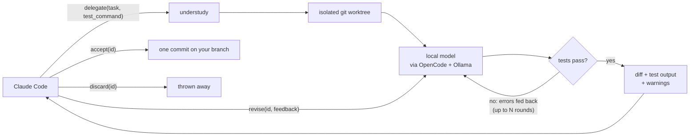

# understudy

**Let Claude Code hand routine coding tasks to a local model, with your tests as the gate and Claude as the reviewer.**

understudy is an [MCP](https://modelcontextprotocol.io) server. It gives Claude Code (or any MCP client) a
`delegate` tool: Claude describes a small, well-defined change, a local model running on your machine does the
work in an isolated git worktree, and your project's tests are run after every attempt. When the tests pass,
Claude gets back the diff to review, and nothing reaches your code until Claude (and you) accept it.

The point is to spend your Claude usage on the hard parts (planning, tricky code, review) and let a free local
model do the typing for the routine ones.



## Why

- **Save quota.** The local model writes the code. Claude only reads a diff, instead of reading files, writing
  code and re-running tests itself.
- **Safe by construction.** All work happens in a separate git worktree on its own branch. Your working tree
  is never touched until `accept`, and a merge conflict is rolled back automatically.
- **Tests are a hard gate.** Failing test output is fed straight back to the local model, for free, until the
  tests pass or the round limit is reached.
- **Claude stays the reviewer.** The Claude you're already talking to reviews the result, so no second Claude
  session is needed. understudy also flags the classic small-model mistakes: when existing tests or functions
  were deleted, it says so, because "tests pass" can just mean "the failing test was removed".
- **A failed revision never loses a passing version.** If `revise` breaks the tests, the change is rolled back
  to the last version that passed.

## Requirements

- Python 3.10+ and git
- [Ollama](https://ollama.com) with a coding model pulled
- [OpenCode](https://opencode.ai), configured with your Ollama models (understudy drives the model through
  OpenCode's file-editing tools). Any other command-line coding agent can be used instead; see
  [Using another builder](#using-another-builder).

## Setup

### 1. Give your model enough context

Ollama runs models with a **4,096-token context by default**, which is too small for a coding agent: the model
loses its instructions and stops without making changes. Create a variant with a larger context window (this
doesn't download anything and leaves the original model untouched):

```sh
curl http://localhost:11434/api/create -d '{"model": "devstral-small-2:24b-16k", "from": "devstral-small-2:24b", "parameters": {"num_ctx": 16384}}'
```

Alternatively, set `OLLAMA_CONTEXT_LENGTH=16384` in the environment of the Ollama server.

### 2. Add the model to OpenCode

In `~/.config/opencode/opencode.json`, list the model under your Ollama provider:

```json
{
  "provider": {
    "ollama": {
      "npm": "@ai-sdk/openai-compatible",
      "options": { "baseURL": "http://localhost:11434/v1" },
      "models": {
        "devstral-small-2:24b-16k": { "name": "Devstral Small 2 (16k)" }
      }
    }
  }
}
```

### 3. Install understudy and add it to Claude Code

```sh
pipx install git+https://github.com/Barry-Lenhart/understudy.git
claude mcp add understudy --scope user \
  -e UNDERSTUDY_MODEL=ollama/devstral-small-2:24b-16k \
  -- understudy-mcp
```

A delegation can take several minutes on local hardware. Claude Code's default MCP tool timeout is generous, but
if you have set `MCP_TOOL_TIMEOUT` yourself, make sure it allows for that (e.g. `1800000`, 30 minutes in ms).

Then, in any git project, ask Claude something like:

> Use understudy to add an `is_palindrome(text)` function to `textutil.py` with a test. Run the tests with
> `pytest -q`.

## Tools

| Tool | What it does |
|---|---|
| `delegate(task, test_command="", repo_path="")` | Creates a worktree, has the local model do the task, and runs `test_command` after each attempt (failures go back to the model). Returns the diff, test output, any warnings, and an `id`. |
| `revise(id, feedback)` | Sends review feedback; the model tries again and the tests re-run. If every attempt breaks the tests, the previous passing version is kept. |
| `accept(id, commit_message="")` | Squash-merges the change into your current branch as one commit and cleans up. Refuses if you have uncommitted changes. |
| `discard(id)` | Deletes the worktree and branch. |
| `status()` | Lists open delegations. |

### Result statuses

| Status | Meaning |
|---|---|
| `tests_passed` | The change passes the tests. Review the diff and warnings. |
| `tests_failing` | Still failing after the maximum number of rounds. |
| `built_untested` | No `test_command` was given. Review extra carefully. |
| `no_changes` | The model didn't change anything. |
| `builder_failed` | The model/tool errored before making changes (see `builder_output`). |
| `revision_made_no_changes` | A `revise` didn't change anything. |
| `revision_failed` | A `revise` broke the tests, so it was rolled back to the previous passing version. |

### Test commands

`test_command` is a shell command run inside the worktree. Worktrees don't contain your virtualenv, so use
`{repo}` to point at the main checkout, e.g. `{repo}/.venv/bin/python -m pytest -q`. The path is also available
as `$UNDERSTUDY_REPO`.

## Configuration

All settings are environment variables (set them with `-e` in `claude mcp add`).

| Variable | Default | |
|---|---|---|
| `UNDERSTUDY_MODEL` | `ollama/qwen3:8b` | Model passed to OpenCode (`provider/model`). |
| `UNDERSTUDY_MAX_ROUNDS` | `3` | Build → test attempts per call. |
| `UNDERSTUDY_BUILDER_TIMEOUT` | `900` | Seconds per model run. |
| `UNDERSTUDY_TEST_TIMEOUT` | `600` | Seconds per test run. |
| `UNDERSTUDY_WORKTREE_DIR` | `~/.cache/understudy/worktrees` | Where worktrees are created. Must be outside `.git`. |
| `UNDERSTUDY_BUILDER` | `opencode` | `opencode` or `command`. |
| `UNDERSTUDY_BUILDER_COMMAND` | | Command for the `command` builder. |
| `UNDERSTUDY_MAX_DIFF_CHARS` | `20000` | Longer diffs are truncated in results. |

### Using another builder

Set `UNDERSTUDY_BUILDER=command` and `UNDERSTUDY_BUILDER_COMMAND` to any command that edits files in the current
directory. `{prompt_file}` is replaced with a file containing the instructions and `{workdir}` with the
worktree path. For example, with [aider](https://aider.chat):

```sh
UNDERSTUDY_BUILDER_COMMAND='aider --model ollama_chat/devstral-small-2:24b-16k --yes --no-auto-commits --message-file {prompt_file}'
```

## Choosing a model

From testing on a consumer GPU:

| Model (16k context) | Typical small task | Notes |
|---|---|---|
| `devstral-small-2:24b` | ~100 s | Clean, targeted edits; follows review feedback. Recommended. |
| `qwen3:8b` | ~20–30 s | Much faster, but edits are sloppier and it often ignores feedback. |

Local models are only as good as they are: understudy's job is to make them safe to use (isolation, test gate,
warnings, rollback) and to keep Claude in the reviewer's seat. Give them small, specific tasks.

## How it works

- Each delegation gets a branch `understudy/<id>` and a worktree under `~/.cache/understudy/worktrees/`.
  Bookkeeping lives in `.git/understudy/`, so it never shows up in `git status`.
- The model's changes are committed in the worktree before tests run, and anything the test run leaves behind is
  cleaned up, so build artifacts never end up in the diff.
- `accept` squash-merges the branch as a single commit authored by you.

## Development

```sh
git clone https://github.com/Barry-Lenhart/understudy.git && cd understudy
python -m venv .venv && .venv/bin/pip install -e ".[dev]"
.venv/bin/pytest
.venv/bin/ruff check . && .venv/bin/ruff format --check .
```

The tests use a fake builder, so they need neither Ollama nor OpenCode.

## License

[MIT](LICENSE)
